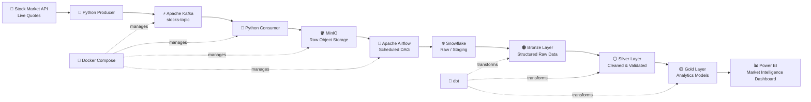

# 📈 Stock-Flow: Real-Time Stock Market Data Pipeline

> An end-to-end modern data engineering project that ingests live stock market data, streams it through Apache Kafka, stores raw events in MinIO, orchestrates ingestion with Apache Airflow, transforms data in Snowflake using dbt, and serves analytics-ready insights in Power BI.

<p align="center">
  <b>Kafka • Python • MinIO • Airflow • Snowflake • dbt • Docker • Power BI</b>
</p>

---

## 📌 Project Overview

**Stock-Flow** is an end-to-end real-time stock market data platform built to demonstrate how modern data engineering systems move data from an external API to a business intelligence dashboard.

The pipeline continuously fetches live market quotes for five technology stocks:

- Apple (`AAPL`)
- Amazon (`AMZN`)
- Alphabet (`GOOGL`)
- Microsoft (`MSFT`)
- Tesla (`TSLA`)

Instead of sending API data directly to a dashboard, the project follows a layered architecture. Market events are streamed through Kafka, persisted in object storage, orchestrated into Snowflake, transformed through Bronze, Silver, and Gold data models with dbt, and finally consumed by Power BI.

The result is a reusable analytics pipeline that separates **data ingestion**, **storage**, **transformation**, and **visualization**.

---

## 🎯 Project Objectives

This project was designed to answer four engineering and analytics questions:

1. How can live stock market data be captured continuously without tightly coupling the API to downstream systems?
2. How can raw streaming events be stored before transformation so the pipeline remains recoverable and auditable?
3. How can raw market data be transformed into analytics-ready models using a medallion architecture?
4. How can business users explore price movement, performance, and volatility through an interactive dashboard?

---

## 🏗️ System Architecture



### Data Flow

```text
Live API
   ↓
Python Producer
   ↓
Kafka Topic
   ↓
Python Consumer
   ↓
MinIO Raw Storage
   ↓
Airflow Orchestration
   ↓
Snowflake
   ↓
dbt: Bronze → Silver → Gold
   ↓
Power BI Dashboard
```

### Why this architecture?

Each component has one clear responsibility:

| Layer | Technology | Responsibility |
|---|---|---|
| Source | Stock Market API | Supplies live market quotes |
| Ingestion | Python | Fetches and serializes API responses |
| Streaming | Apache Kafka | Buffers and distributes market events |
| Raw Storage | MinIO | Preserves consumed events before warehouse loading |
| Orchestration | Apache Airflow | Schedules and coordinates data movement |
| Warehouse | Snowflake | Stores scalable analytical datasets |
| Transformation | dbt | Builds tested, modular SQL models |
| Analytics | Power BI | Converts Gold models into interactive insights |
| Infrastructure | Docker | Runs local services consistently |

---

## ⚡ Technology Stack

### Data Engineering

- **Python** — API integration, Kafka producer, and Kafka consumer
- **Apache Kafka** — real-time event streaming
- **MinIO** — S3-compatible object storage for raw market events
- **Apache Airflow** — workflow orchestration and scheduled warehouse ingestion
- **Docker & Docker Compose** — reproducible local infrastructure

### Data Platform

- **Snowflake** — cloud data warehouse
- **dbt** — SQL transformations, model dependency management, and layered data modeling

### Analytics

- **Power BI** — interactive market intelligence dashboard
- **DAX** — KPI logic, normalized volatility metrics, and conditional formatting

---

## ✨ Key Features

- Fetches **live stock market data** from an external API
- Streams events through a dedicated **Kafka topic**
- Decouples data producers and consumers
- Persists raw events in **MinIO**
- Uses **Airflow** for automated ingestion into Snowflake
- Implements a **Bronze → Silver → Gold** medallion architecture
- Uses modular **dbt models** for transformation
- Creates dedicated Gold models for dashboard use cases
- Supports interactive filtering across five stocks
- Applies market-style conditional formatting:
  - 🟢 positive movement
  - 🔴 negative movement
- Provides a normalized **0–100 volatility positioning model**
- Delivers an analytics-ready **Power BI market intelligence dashboard**

---

## 📂 Repository Structure

```text
real-time-stocks-pipeline/
│
├── producer/
│   └── producer.py
│
├── consumer/
│   └── consumer.py
│
├── dag/
│   └── minio_to_snowflake.py
│
├── dbt_stocks/
│   ├── dbt_project.yml
│   └── models/
│       ├── bronze/
│       │   ├── bronze_stg_stock_quotes.sql
│       │   └── sources.yml
│       │
│       ├── silver/
│       │   └── silver_clean_stock_quotes.sql
│       │
│       └── gold/
│           ├── gold_candlestick.sql
│           ├── gold_kpi.sql
│           └── gold_treechart.sql
│
├── powerbi/
│   ├── StockFlow.pbix
│   └── dashboard-preview.png
│
├── assets/
│   └── architecture.png
│
├── docker-compose.yml
├── requirements.txt
├── .env.example
├── .gitignore
├── LICENSE
└── README.md
```

> Update the tree above if your final repository uses different file names or folders.

---

## 🔄 End-to-End Pipeline Walkthrough

### 1. Live Market Data Ingestion

A Python producer requests current market data from the external stock API.

The producer:

- calls the API for configured stock symbols
- extracts required market fields
- converts records into JSON
- publishes each event to Kafka
- repeats the process continuously at the configured interval

Example event structure:

```json
{
  "symbol": "AAPL",
  "current_price": 393.45,
  "change_amount": 14.25,
  "change_percent": 4.84,
  "event_time": "2026-07-05T18:30:00"
}
```

---

### 2. Real-Time Streaming with Kafka

Kafka acts as the event backbone of the pipeline.

```text
Python Producer → stocks-topic → Python Consumer
```

Using Kafka prevents the API producer from being directly dependent on the storage or analytics layer. If downstream processing slows temporarily, events can remain available in the stream instead of being lost immediately.

---

### 3. Raw Data Lake with MinIO

The Kafka consumer reads stock events and writes them to MinIO.

This layer serves as the raw landing zone and provides:

- separation between streaming and warehouse workloads
- a recoverable copy of consumed events
- support for replay and reprocessing
- a clean boundary between ingestion and transformation

```text
Kafka
  ↓
Consumer
  ↓
MinIO Raw Bucket
```

---

### 4. Workflow Orchestration with Airflow

Apache Airflow coordinates the movement of raw files from MinIO into Snowflake.

The DAG is responsible for:

- identifying new raw data
- loading records into Snowflake
- managing task dependencies
- scheduling recurring pipeline runs
- exposing execution status and failures

The pipeline is designed to run on a frequent schedule so newly captured market data becomes available for transformation and analytics.

---

### 5. Snowflake Data Warehouse

Snowflake is the analytical storage layer.

The warehouse separates raw ingestion from business-facing datasets and provides the foundation for dbt transformations.

```text
Raw / Staging
      ↓
    Bronze
      ↓
    Silver
      ↓
     Gold
```

---

## 🥉🥈🥇 Medallion Architecture with dbt

### 🥉 Bronze Layer — Structured Raw Data

**Model:** `bronze_stg_stock_quotes.sql`

Purpose:

- references warehouse source data
- standardizes the raw schema
- preserves source-level market fields
- creates the first dbt-managed model

The Bronze layer remains close to the original source.

---

### 🥈 Silver Layer — Cleaned and Validated Data

**Model:** `silver_clean_stock_quotes.sql`

Purpose:

- casts fields into correct data types
- standardizes symbols
- handles invalid or missing records
- removes unwanted duplicates where required
- prepares trusted records for analytics

The Silver layer becomes the reusable source for downstream business models.

---

### 🥇 Gold Layer — Analytics-Ready Models

The Gold layer is designed around Power BI use cases.

#### `gold_kpi.sql`

Supports headline market metrics:

- current price
- percentage change
- absolute change amount
- most volatile stock

#### `gold_candlestick.sql`

Supports time-based market analysis:

- open price
- high price
- low price
- close price
- candle timestamp
- trend information

#### `gold_treechart.sql`

Supports comparative analytics:

- average price
- volatility
- relative volatility
- normalized volatility index
- stock-level market positioning

This approach keeps complex transformation logic out of Power BI and makes the dashboard consume business-ready models.

---

## 📊 Power BI Dashboard

### Stock-Flow: Real-Time Market Intelligence

The final dashboard provides a single-page overview of five technology stocks.


### Dashboard Components

#### 1. Stock Selector

Interactive buttons allow users to filter the dashboard by:

`AAPL` • `AMZN` • `GOOGL` • `MSFT` • `TSLA`

The selection updates connected KPIs and analytical visuals.

#### 2. KPI Cards

The dashboard displays:

- **Current Price**
- **% Change**
- **Change Amount**
- **Most Volatile Stock**

Positive and negative movement is formatted dynamically for faster interpretation.

#### 3. Price Movement Over Time

Tracks stock closing-price movement across captured market timestamps.

#### 4. Five-Stock Market Map

A treemap compares stocks visually while using market direction as the color signal:

- 🟢 teal — positive performance
- 🔴 red — negative performance

#### 5. Performance Comparison

A horizontal bar chart ranks the five stocks by percentage change and makes gainers and losers immediately visible.

#### 6. Risk Positioning Map

A scatter plot positions stocks using normalized volatility metrics.

- **X-axis:** Volatility Index
- **Y-axis:** Relative Volatility Index
- **Scale:** 0–100

This makes relative risk positioning easier to compare across stocks with different raw volatility values.

---

## 🧮 Analytical Logic

Two normalized DAX measures power the Risk Positioning Map.

### Relative Volatility Index

```DAX
Relative Volatility Index =
VAR MinValue =
    MINX(
        ALL(GOLD_TREECHART[SYMBOL]),
        CALCULATE(MAX(GOLD_TREECHART[RELATIVE_VOLATILITY]))
    )
VAR MaxValue =
    MAXX(
        ALL(GOLD_TREECHART[SYMBOL]),
        CALCULATE(MAX(GOLD_TREECHART[RELATIVE_VOLATILITY]))
    )
VAR CurrentValue =
    MAX(GOLD_TREECHART[RELATIVE_VOLATILITY])
RETURN
    DIVIDE(CurrentValue - MinValue, MaxValue - MinValue, 0) * 100
```

### Volatility Index

```DAX
Volatility Index =
VAR MinVol =
    MINX(
        ALL(GOLD_TREECHART[SYMBOL]),
        CALCULATE(MAX(GOLD_TREECHART[VOLATILITY]))
    )
VAR MaxVol =
    MAXX(
        ALL(GOLD_TREECHART[SYMBOL]),
        CALCULATE(MAX(GOLD_TREECHART[VOLATILITY]))
    )
VAR CurrentVol =
    MAX(GOLD_TREECHART[VOLATILITY])
RETURN
    DIVIDE(CurrentVol - MinVol, MaxVol - MinVol, 0) * 100
```

Min-max normalization converts raw volatility values into a common range:

```text
Normalized Value = (Current − Minimum) / (Maximum − Minimum) × 100
```

This prevents stocks with different raw scales from overlapping around zero and makes the scatter plot easier to interpret.

---

## 🚀 Getting Started

### Prerequisites

Install or configure:

- Docker Desktop
- Python 3.x
- a Snowflake account
- dbt with the Snowflake adapter
- Power BI Desktop
- a valid stock market API key

### 1. Clone the Repository

```bash
git clone <your-repository-url>
cd real-time-stocks-pipeline
```

### 2. Create Environment Variables

Create a `.env` file from the example:

```bash
cp .env.example .env
```

Add your own credentials:

```env
STOCK_API_KEY=your_api_key

KAFKA_BOOTSTRAP_SERVERS=kafka:9092

MINIO_ENDPOINT=minio:9000
MINIO_ACCESS_KEY=your_access_key
MINIO_SECRET_KEY=your_secret_key

SNOWFLAKE_ACCOUNT=your_account
SNOWFLAKE_USER=your_user
SNOWFLAKE_PASSWORD=your_password
SNOWFLAKE_DATABASE=your_database
SNOWFLAKE_SCHEMA=your_schema
SNOWFLAKE_WAREHOUSE=your_warehouse
```

> Never commit `.env`, API keys, passwords, or Snowflake credentials to GitHub.

### 3. Start the Infrastructure

```bash
docker compose up -d
```

Verify that the required services are running:

```bash
docker compose ps
```

### 4. Install Python Dependencies

```bash
pip install -r requirements.txt
```

### 5. Start the Producer

```bash
python producer/producer.py
```

### 6. Start the Consumer

```bash
python consumer/consumer.py
```

### 7. Run the Airflow Pipeline

Open the Airflow UI, enable the stock pipeline DAG, and trigger or wait for the scheduled run.

### 8. Run dbt Transformations

```bash
cd dbt_stocks
dbt debug
dbt run
dbt test
```

### 9. Connect Power BI

Connect Power BI to the Snowflake Gold models and refresh the semantic model.

---

## 📈 Results

The completed project delivers:

- a functioning API-to-dashboard data flow
- event-driven ingestion through Kafka
- persistent raw storage in MinIO
- automated warehouse loading through Airflow
- structured Bronze, Silver, and Gold models
- analytics-ready Snowflake tables
- modular SQL transformations with dbt
- an interactive Power BI dashboard
- stock-level comparison across price, performance, and volatility

The project demonstrates how independent modern data tools can work together as one complete analytical system rather than as isolated technologies.

---

## 💡 Key Engineering Learnings

Building the project required solving problems across multiple layers:

- coordinating containerized services
- handling communication between Kafka producers and consumers
- preserving raw events before warehouse ingestion
- orchestrating recurring data movement
- separating raw, cleaned, and analytical models
- designing Gold tables around dashboard requirements
- creating DAX measures that behave correctly under filter context
- preventing slicers from producing misleading volatility comparisons
- designing consistent positive/negative market formatting

The most important design lesson was that a real-time dashboard is only the final layer. Reliable analytics depends on the full pipeline behind it.

---

## ⚠️ Current Limitations

The current version intentionally focuses on a small portfolio of five technology stocks.

Limitations include:

- API rate limits and source availability
- local Docker infrastructure
- a fixed set of tracked symbols
- no dedicated schema registry
- limited automated data-quality coverage
- no production alerting layer
- dashboard freshness depends on upstream pipeline execution and refresh configuration

These constraints keep the project manageable while preserving the architecture of a larger production system.

---

## 🔮 Future Scope

Future versions can extend the project in several directions:

- add more stocks and configurable watchlists
- use Kafka Schema Registry for event contracts
- add dead-letter queues for malformed events
- implement stronger dbt tests and freshness checks
- add Great Expectations or Soda for data-quality monitoring
- deploy infrastructure to a cloud environment
- add CI/CD for dbt and Python code
- implement Airflow failure notifications
- add historical backfill workflows
- create portfolio-level analytics
- add technical indicators such as RSI, MACD, and moving averages
- introduce anomaly detection for unusual price or volatility movements
- add forecasting models
- implement row-level security in Power BI
- add pipeline observability and end-to-end latency monitoring

---

## 📌 Conclusion

**Stock-Flow** demonstrates a complete modern data engineering lifecycle:

```text
Collect → Stream → Store → Orchestrate → Transform → Analyze
```

The project combines real-time ingestion with analytical data modeling and business intelligence. Its main value is not any single tool; it is the integration of multiple systems into one traceable data flow.

From a live market event entering Kafka to an insight appearing in Power BI, every layer has a defined purpose. This makes the project a practical demonstration of real-time data engineering, cloud warehousing, analytics engineering, orchestration, and BI development.

---

## 🗺️ Project Status

| Component | Status |
|---|---|
| Live API ingestion | ✅ Completed |
| Kafka streaming | ✅ Completed |
| MinIO raw storage | ✅ Completed |
| Airflow orchestration | ✅ Completed |
| Snowflake warehouse | ✅ Completed |
| dbt transformations | ✅ Completed |
| Power BI dashboard | ✅ Completed |
| Cloud deployment | 🔜 Future scope |
| CI/CD | 🔜 Future scope |
| Monitoring & alerting | 🔜 Future scope |

---

## 👤 Author

**Rohit Raj**

M.Sc. Economics & Management  
Indian Institute of Information Technology, Lucknow

Interested in Data Analytics, Product Analytics, Business Intelligence, and Data Engineering.

- LinkedIn: `Add your LinkedIn URL`
- GitHub: `Add your GitHub URL`
- Email: `Add your professional email`

---

## ⭐ Support

If you found this project useful, consider giving the repository a star.

Contributions, suggestions, and feedback are welcome.
