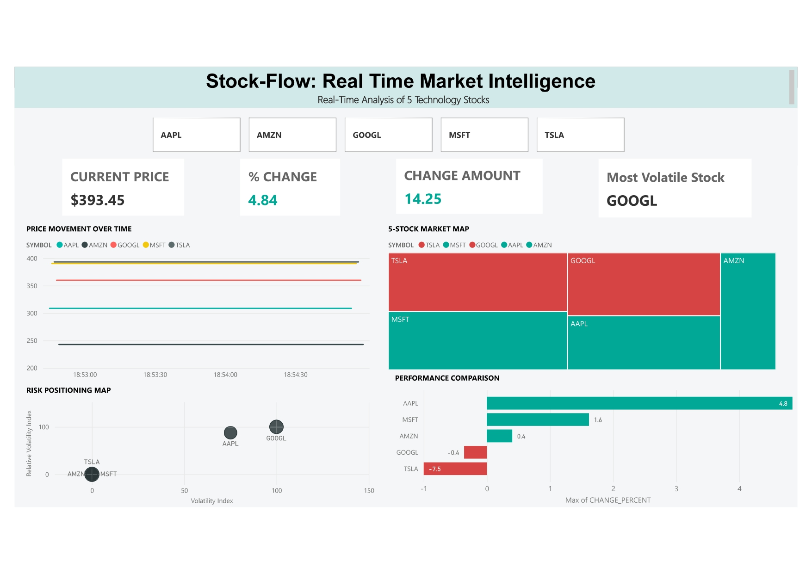

# Stock-Flow: Real-Time Stock Market Data Pipeline


---

## 📌 Project Overview

**Stock-Flow: Real-Time Market Intelligence is an end-to-end data engineering project built using the Modern Data Stack. It captures live stock market data and transforms it through real-time streaming, orchestration, cloud warehousing, and analytics into interactive market intelligence.**

The pipeline tracks five tech stocks: **AAPL · AMZN · GOOGL · MSFT · TSLA**.

<p align="center">
  
</p>

## 🎯 Problem Statement

Real-time market data moves continuously, but building a reliable path from a live API to business-ready insights is challenging. Directly connecting data sources to dashboards creates tightly coupled systems, raw events can be lost before processing, and unstructured data is difficult to use for consistent analysis.

The project addresses four key challenges:

* How can live market data be captured without coupling the API directly to downstream systems?
* How can raw events remain recoverable before transformation?
* How can raw data be converted into trusted, analytics-ready models?
* How can users interactively explore stock price, performance, and volatility?

## 💡 Solution

**Stock-Flow** solves these challenges through a decoupled, end-to-end data architecture. Live market events are streamed through **Kafka**, preserved in **MinIO**, orchestrated with **Airflow**, loaded into **Snowflake**, and transformed with **dbt** through **Bronze, Silver, and Gold layers**.

The analytics-ready Gold models power an interactive **Power BI dashboard**, enabling users to explore price movement, compare stock performance, and analyze volatility across five technology stocks.

**API → Kafka → MinIO → Airflow → Snowflake → dbt → Power BI**

---

## 🏗️ Architecture
The architecture follows a decoupled data flow, with each component responsible for a specific stage of the pipeline:

**Ingest → Stream → Store → Orchestrate → Transform → Analyze**

| Layer | Tool | Role |
|---|---|---|
| Source | Stock API | Live market quotes |
| Ingestion | Python | Fetch & serialize events |
| Streaming | Kafka | Buffer & distribute events |
| Raw storage | MinIO | Recoverable event landing zone |
| Orchestration | Airflow | Schedule warehouse loads |
| Warehouse | Snowflake | Analytical storage |
| Transformation | dbt | Modeled, tested SQL layers |
| Analytics | Power BI | Interactive dashboard |
| Infra | Docker | Local service management |

---

## 📂 Repository Structure

```
stock-flow/
├── producer/producer.py
├── consumer/consumer.py
├── dag/minio_to_snowflake.py
├── dbt_stocks/
│   ├── dbt_project.yml
│   └── models/
│       ├── bronze/   → bronze_stg_stock_quotes.sql
│       ├── silver/   → silver_clean_stock_quotes.sql
│       └── gold/     → gold_kpi.sql · gold_candlestick.sql · gold_treechart.sql
├── powerbi/StockFlow.pbix
├── assets/architecture.png
├── docker-compose.yml
├── requirements.txt
└── .env.example
```

---

## 🔄 How Data Moves

**1. Ingestion** — a Python producer polls the stock API on a fixed interval, serializes each quote to JSON, and publishes it to a Kafka topic.

```json
{
  "symbol": "AAPL",
  "current_price": 393.45,
  "change_amount": 14.25,
  "change_percent": 4.84,
  "event_time": "2026-07-05T18:30:00"
}
```

**2. Streaming** — Kafka decouples the producer from everything downstream. If storage or the warehouse slows down, events wait safely in the topic instead of getting dropped.

**3. Raw storage** — a consumer reads from Kafka and writes events into MinIO, giving the pipeline a replayable, auditable landing zone before anything touches the warehouse.

**4. Orchestration** — an Airflow DAG picks up new raw files, loads them into Snowflake, and runs on a recurring schedule with visibility into failures.

**5. Transformation (dbt, medallion architecture)**

| Layer | Model | Purpose |
|---|---|---|
| 🥉 Bronze | `bronze_stg_stock_quotes` | Standardizes raw schema, stays close to source |
| 🥈 Silver | `silver_clean_stock_quotes` | Casts types, dedupes, validates records |
| 🥇 Gold | `gold_kpi`, `gold_candlestick`, `gold_treechart` | Dashboard-ready business models |

Keeping this logic in dbt means Power BI only ever consumes clean, business-ready tables — never raw computation.

**6. Analytics** — Power BI connects to the Gold models and renders the dashboard below.

---

## 📊 Dashboard



**Components:**
- **Stock selector** — filter across AAPL, AMZN, GOOGL, MSFT, TSLA
- **KPI cards** — current price, % change, change amount, most volatile stock
- **Price trend** — closing price over time
- **Market map** — treemap colored by direction (teal = up, red = down)
- **Performance ranking** — horizontal bar chart of % change across stocks
- **Risk positioning** — scatter plot of normalized volatility (0–100 scale on both axes)


## 🚀 Getting Started

**Prerequisites:** Docker Desktop, Python 3.x, a Snowflake account, dbt (Snowflake adapter), Power BI Desktop, a stock API key.

```bash
# 1. Clone
git clone <your-repository-url>
cd stock-flow

# 2. Configure environment
cp .env.example .env   # fill in API, Kafka, MinIO, Snowflake credentials

# 3. Start infrastructure
docker compose up -d
docker compose ps       # verify services are healthy

# 4. Install dependencies
pip install -r requirements.txt

# 5. Run producer & consumer (separate terminals)
python producer/producer.py
python consumer/consumer.py

# 6. Trigger the Airflow DAG
# open the Airflow UI → enable → trigger the stock pipeline DAG

# 7. Run dbt
cd dbt_stocks
dbt debug && dbt run && dbt test

# 8. Connect Power BI to the Gold models and refresh
```

> Never commit `.env`, API keys, or Snowflake credentials.

---

## 🗺️ Status

| Component | Status |
|---|---|
| Live API ingestion | ✅ Done |
| Kafka streaming | ✅ Done |
| MinIO raw storage | ✅ Done |
| Airflow orchestration | ✅ Done |
| Snowflake warehouse | ✅ Done |
| dbt transformations | ✅ Done |
| Power BI dashboard | ✅ Done |
| Cloud deployment | 🔜 Planned |
| CI/CD | 🔜 Planned |
| Monitoring & alerting | 🔜 Planned |

---

## ⚠️ Limitations

- Fixed watchlist of five stocks, bounded by API rate limits
- Runs on local Docker infra, not cloud-deployed
- No schema registry or dead-letter queue yet
- Dashboard freshness depends on upstream pipeline runs

## 🔮 Future Scope

- Configurable watchlists, Kafka Schema Registry, dead-letter queues
- Great Expectations / Soda for data-quality monitoring
- CI/CD for dbt and Python, Airflow failure alerts, historical backfills
- Technical indicators (RSI, MACD, moving averages), anomaly detection, forecasting
- Row-level security in Power BI, end-to-end latency monitoring

---

## 💡 Why This Project

The value here isn't any single tool — it's the integration: a live market event travels from Kafka to MinIO to Snowflake to dbt to Power BI, with every layer serving one clear purpose. It's a working demonstration of real-time ingestion, cloud warehousing, analytics engineering, orchestration, and BI development as one connected system.

---

## 👤 Author

**Rohit Raj**
---

If this was useful, a ⭐ on the repo is appreciated. Contributions and feedback welcome.
